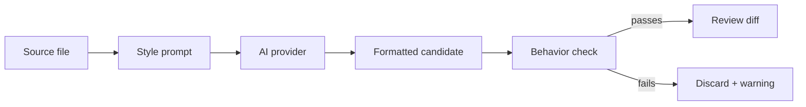

<div align="center">

# Codexa

### AI-assisted code formatting for backend projects, with reviewable diffs and behavior-preservation checks.

<p>
  
  
  
  
</p>

<p>
  <a href="#quick-start"><strong>Quick start</strong></a>
  ·
  <a href="#using-codexa"><strong>Using Codexa</strong></a>
  ·
  <a href="#architecture"><strong>Architecture</strong></a>
  ·
  <a href="docs/PRIVACY.md"><strong>Privacy</strong></a>
</p>

</div>

---

Codexa is a web workspace for formatting backend TypeScript and JavaScript with AI. Drop in a ZIP, choose a folder, upload one file, or paste a snippet. Codexa scans the source, lets you select exactly what should be formatted, sends each unit through a provider-backed style engine, then gives you a diff before you export anything.

It is built for teams that want a strong house style without trusting model output blindly. The formatter can add block-comment section headers, group imports, reorder declarations, and reshape files to match the examples in [docs/examples/](docs/examples/), while rejecting outputs that appear to change program behavior.

```text
source in     scan + select     provider run     preservation check     review + export
   |               |                 |                    |                    |
 ZIP/folder -> backend map -> house-style prompt -> structural guard -> diff, ZIP, JSON
 file/text      file picker       OpenAI/Anthropic       warnings             report
```

## Why Codexa

| Capability | What it means |
| --- | --- |
| Project-aware intake | Scan a ZIP archive, browser-selected folder, single file, or pasted snippet. |
| Selective formatting | Pick the exact modules and files to process before a run starts. |
| Provider choice | Use OpenAI, Anthropic, OpenAI-compatible endpoints, local Ollama, or the offline reference provider. |
| House-style prompts | Prompts are assembled from concrete examples, not vague formatting instructions. |
| Behavior guardrails | TypeScript/JavaScript results are checked for identifier and literal preservation. |
| Review-first workflow | Inspect diffs, warnings, unchanged files, and failures before exporting output. |
| Exportable results | Download changed files, a rebuilt project ZIP, or a JSON run report. |
| Monorepo internals | Framework-agnostic engine packages power a NestJS API, Next.js app, and CLI. |

## Quick start

### Requirements

| Tool | Version |
| --- | --- |
| Node.js | `>=20.0.0` |
| npm | `>=10` |
| Provider | Remote API key or local Ollama model |

### Install

```bash
npm install
npm run build
```

### Start the API

```bash
npm run start --workspace @codexa/server
```

The API listens on `http://localhost:4000` by default. Set `PORT` to change it.

### Start the web app

```bash
npm run dev --workspace @codexa/web
```

The web app runs on `http://localhost:3001`.

If the API is running somewhere else, set the frontend base URL:

```bash
NEXT_PUBLIC_API_BASE=http://localhost:4000
```

## GitHub sign-in and pull requests

Codexa can sign users in with GitHub, pull a repository they can push to, format selected files, and open a pull request with the result — all without leaving the web app.

### 1. Register a GitHub OAuth App

Create an OAuth App at **GitHub → Settings → Developer settings → OAuth Apps** with:

| Field | Value |
| --- | --- |
| Homepage URL | `http://localhost:3001` |
| Authorization callback URL | `http://localhost:4000/auth/github/callback` |

### 2. Configure the API server

Copy the template and fill in your OAuth credentials:

```bash
cp .env.example .env
```

The server loads `.env` from the repo root automatically on start (real shell variables still take precedence). For the web app, copy `apps/web/.env.example` to `apps/web/.env.local`. These variables are read:

| Variable | Purpose | Default |
| --- | --- | --- |
| `CODEXA_GITHUB_CLIENT_ID` | OAuth App client id | — (required) |
| `CODEXA_GITHUB_CLIENT_SECRET` | OAuth App client secret | — (required) |
| `CODEXA_GITHUB_CALLBACK_URL` | OAuth redirect URI | `http://localhost:4000/auth/github/callback` |
| `CODEXA_GITHUB_SCOPES` | Requested OAuth scopes | `repo read:user user:email` |
| `CODEXA_WEB_ORIGIN` | Web origin the callback returns to | `http://localhost:3001` |
| `CODEXA_AUTH_SECRET` | Secret for signing session tokens and OAuth state | `codexa-dev-secret-change-me` |

The `repo` scope is what lets Codexa create a branch and open a pull request on a repository the user can push to.

### 3. The flow

```text
Continue with GitHub  ->  pick a repository  ->  select files  ->  format  ->  Create pull request
        OAuth                /connections/github/repos        run engine        Git Data API branch + PR
```

When you open a pull request, Codexa checks whether you can push to the repository:

- **Push access** — it creates a branch (`codexa/format-<run>`) directly on the repository and opens the PR.
- **Read-only access** — it forks the repository to your account, commits the branch there, and opens a cross-repository PR back to the original (`maintainer_can_modify` enabled). The repository picker marks these with a **via fork** badge.

Either way the PR targets the repository's default branch.

## Using Codexa

```text
1. Configure provider
2. Add source
3. Select files
4. Run formatter
5. Review diffs
6. Export results
```

### 1. Configure a provider

Open **Providers** and choose one of the supported engines.

| Provider | Use it for | Configuration |
| --- | --- | --- |
| `openai` | Hosted OpenAI models | API key and model |
| `anthropic` | Hosted Anthropic models | API key and model |
| `openai-compatible` | Compatible gateways or self-hosted APIs | Base URL, API key, and model |
| `ollama` | Local model runs | Host and model, usually `localhost:11434` |
| `reference` | Offline development and deterministic tests | No credentials |

Remote providers may receive the selected source code. Read [docs/PRIVACY.md](docs/PRIVACY.md) before using Codexa with private or sensitive repositories.

### 2. Add source

Codexa supports five intake modes:

| Mode | Best for |
| --- | --- |
| GitHub repository | Pulling a connected repo and opening a pull request with the result |
| Upload a ZIP | Full projects and reproducible archives |
| Choose a folder | Local browser-based project selection |
| Add a file | One TypeScript or JavaScript file |
| Paste a snippet | Quick experiments or small examples |

### 3. Select files

After scanning, Codexa shows detected backend modules, file paths, languages, and estimated token use. You can search, filter, expand modules, and choose only the files you want to process.

### 4. Review and export

When a run finishes, the review screen shows:

- Changed and unchanged files.
- Failed files and provider warnings.
- Diffs for formatted output.
- A structured JSON report.
- Downloads for changed files or a rebuilt folder ZIP.

Accounts are optional for local use. Without signing in, settings and local run context are kept on the device where possible.

## How formatting works



1. Source is sent to a provider with a system prompt assembled from [docs/examples/](docs/examples/).
2. The provider returns a complete formatted candidate.
3. Codexa runs `compareTypeScriptStructure` against the original and formatted source.
4. Identifier and literal multisets must remain unchanged. Reordering and added comments are allowed.
5. Passing results are shown as diffs. Diverging results are discarded with warnings.

## CLI

Build first:

```bash
npm run build
```

Discover backend modules in a workspace:

```bash
npm run discover -- /path/to/workspace
```

Use discovery flags when needed:

```bash
npm run discover -- /path/to/workspace --json
npm run discover -- /path/to/workspace --no-cache
npm run discover -- /path/to/workspace --no-git
```

Validate the starter style profile:

```bash
npm run validate:starter
```

## Development

| Command | Purpose |
| --- | --- |
| `npm run build` | Generate style examples, then build packages and apps. |
| `npm run typecheck` | Run TypeScript project references. |
| `npm test` | Build, then run package and server tests. |
| `npm run check` | Run typecheck and tests. |
| `npm run clean` | Clean TypeScript build outputs. |

Web app commands:

```bash
npm run dev --workspace @codexa/web
npm run build --workspace @codexa/web
npm run start --workspace @codexa/web
```

Server commands:

```bash
npm run start --workspace @codexa/server
npm run start:dev --workspace @codexa/server
```

## Architecture

```text
codexa/
  apps/
    web/       Next.js interface for intake, provider setup, selection, review
    server/    NestJS API for auth, settings, intake, providers, runs
    cli/       Headless discovery and profile validation

  packages/
    core/                 Shared domain types
    profile-schema/       Style profile schema and validation
    language-typescript/  TypeScript analysis and preservation checks
    discovery/            Workspace, backend, filesystem, and git discovery
    provider/             Provider adapters, prompt assembly, semantic helpers
    orchestrator/         Plan and run engine

  docs/
    examples/             House-style examples used by prompts and goldens
    PRIVACY.md            Source-code privacy notes
    REBUILD_PLAN.md       Project plan and implementation status
```

The engine packages are framework-agnostic. `apps/server` is the composition root that wires providers, persistence, discovery, and orchestration together. `apps/web` is the product surface.

## Style examples and goldens

The examples in [docs/examples/](docs/examples/) are Codexa's house-style source of truth. They feed prompt assembly and conformance checks.

Run deterministic checks:

```bash
npm run build
```

Run live model conformance with Anthropic:

```bash
CODEXA_LIVE_GOLDENS=1 ANTHROPIC_API_KEY=... npm run build
node --test packages/provider/dist/style-conformance.test.js
```

Use the golden harness for tuning and per-example diffs:

```bash
ANTHROPIC_API_KEY=... GOLDEN_CONCURRENCY=1 GOLDEN_THROTTLE_MS=26000 node scripts/run-goldens.mjs
```

## Persistence

Codexa uses in-memory repositories by default so local development stays lightweight. Postgres support is modeled through the Prisma schema in [apps/server/prisma/schema.prisma](apps/server/prisma/schema.prisma), but Prisma-backed repository bindings still need to be wired in before it behaves as a persistent deployment.

Prepare a database:

```bash
export DATABASE_URL=postgresql://...
npx prisma migrate dev
npx prisma generate
```

Then bind the repository injection tokens in `apps/server/src/persistence/` to Prisma-backed implementations instead of the in-memory defaults.

## Project status

Codexa is early-stage software. The core formatting, provider, discovery, web review, and test harness pieces are present. Production deployment hardening is still in progress.

Implementation progress lives in [docs/REBUILD_PLAN.md](docs/REBUILD_PLAN.md).

## Contributing

Contributions are welcome. Before opening a pull request, run:

```bash
npm run check
```

Please keep changes focused, add tests for behavior changes, and update docs when user-facing workflows change.

---

<div align="center">

Built as an experiment in making AI formatting feel inspectable, reversible, and worthy of a real codebase.

</div>
